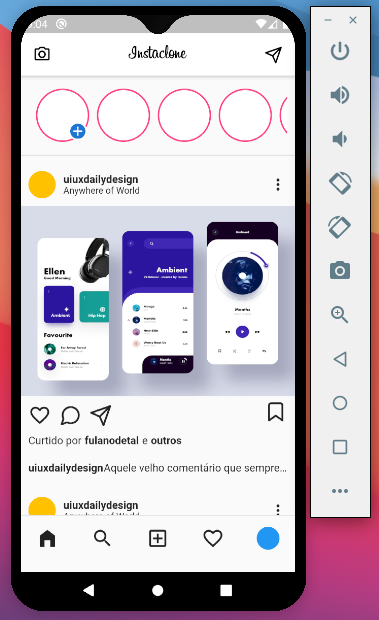

# InstaClone

Clone da interface do instagram. Foi clonado apenas a página principal e somente componentes gráficos.

## Print Screen



## Instalação

Para iniciar a aplicação é necessário ter o SDK do flutter instalado e um emulador ou dispositivo para executar a aplicação. Para instalar a aplicação siga os seguintes passos:

- Clone a aplicação

```
$ git clone https://github.com/jvitorssouza/instaclone.git
```

- Entre na pasta do projeto

```
$ cd instaclone
```

- Certifique-se do emulador estar rodando ou que um dispositivo esteja conectado na porta USB.

- Inicie o app

```
$ flutter run
```
